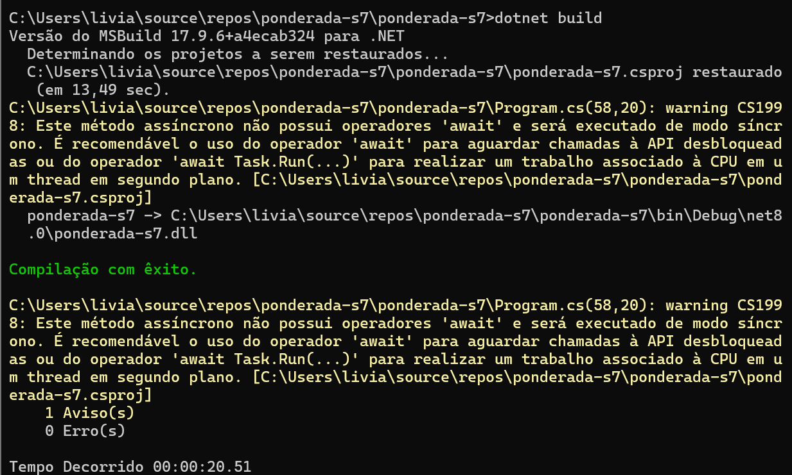
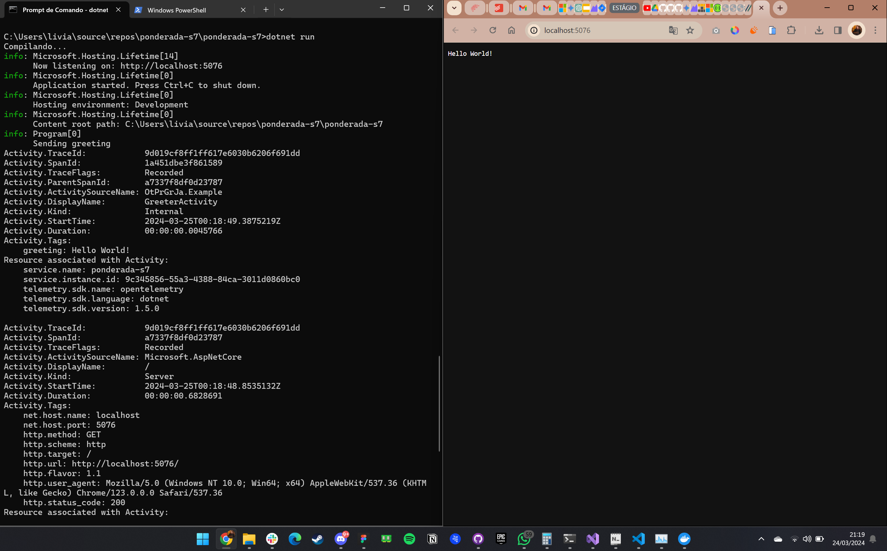
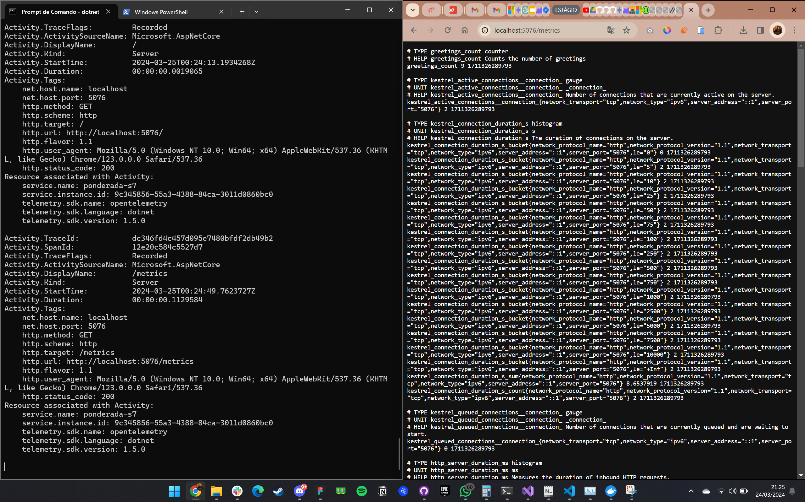
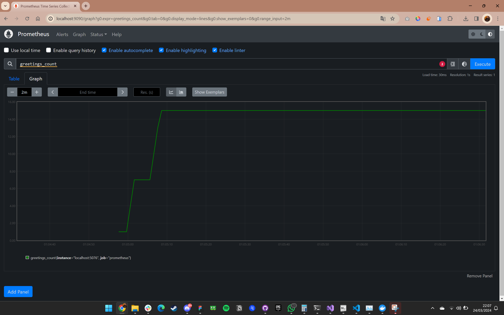
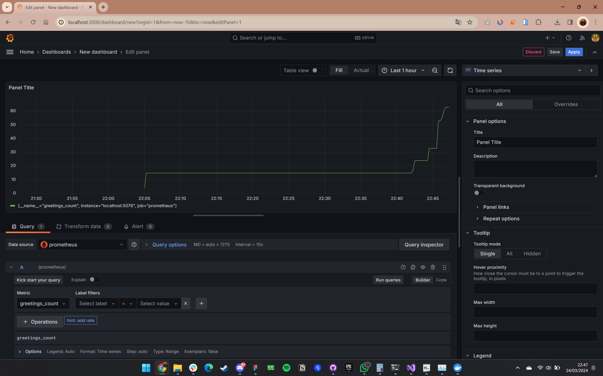
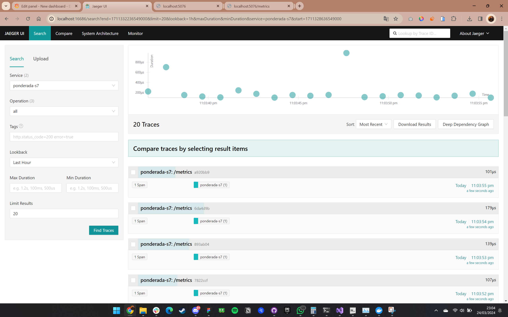
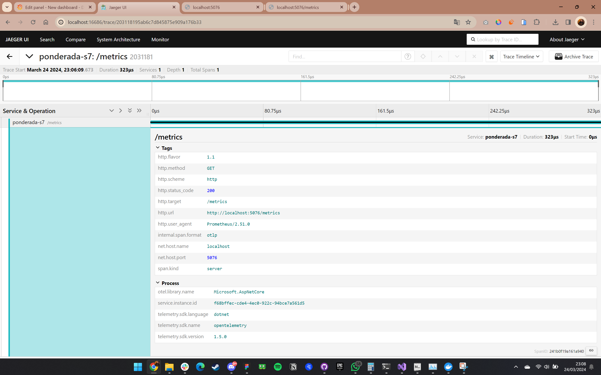
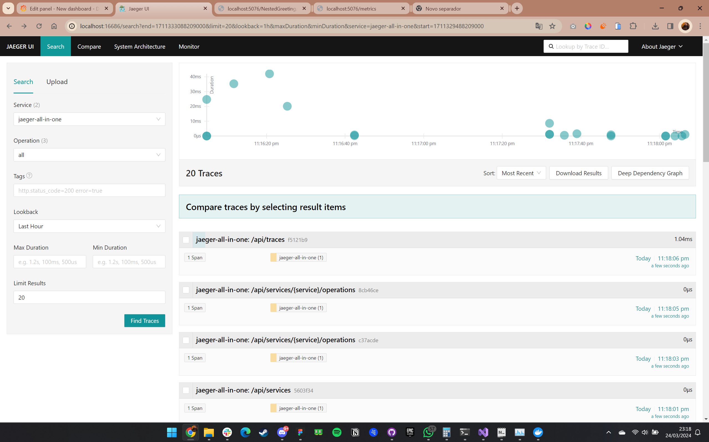
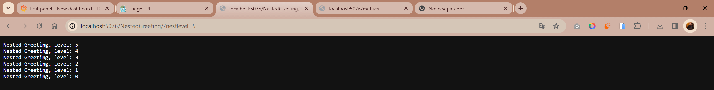
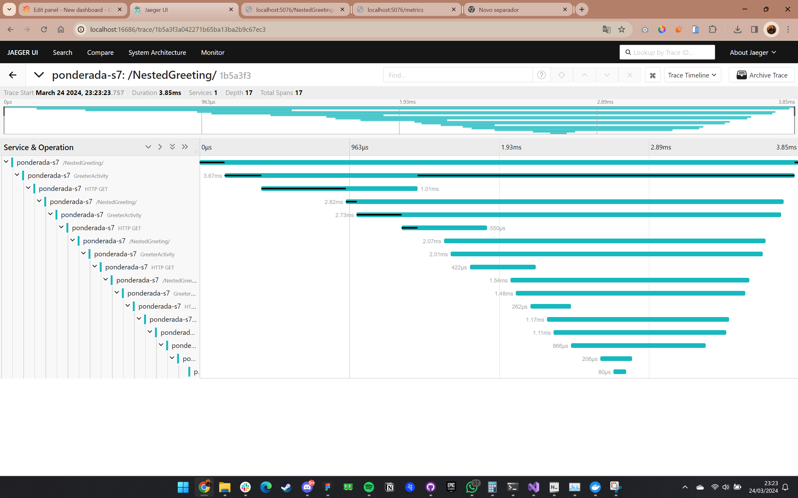

# Relatório Observabilidade .NET com OpenTelemetry

## Sobre a tecnologia

### O que é observabilidade?
No contexto de um sistema distribuído, a observabilidade é a capacidade de monitorar e analisar telemetria sobre o estado de cada componente. Isso permite observar mudanças no desempenho e diagnosticar por que essas mudanças ocorrem.

### Diferença entre observabilidade e depuração:
A observabilidade é transparente para a operação principal e tem um impacto mínimo no desempenho, enquanto a depuração é invasiva e pode afetar a operação da aplicação.

### Componentes da observabilidade:
- Logs: registram operações individuais, como solicitações recebidas, falhas em componentes específicos ou pedidos feitos.
- Métricas: fornecem uma visão geral do estado do sistema em um determinado momento, como uso da CPU, uso da memória e tempo de resposta de solicitações.
- Rastreamento: permite acompanhar o fluxo de uma solicitação através do sistema, mapeando as dependências entre os componentes.
- OpenTelemetry: o OpenTelemetry (OTel) é um padrão aberto e multiplataforma para coleta e emissão de dados de telemetria. O OTel fornece APIs para instrumentar aplicações .NET e enviar dados para diferentes sistemas de APM (Application Performance Monitoring), como Prometheus, Grafana e Azure Monitor.

## Conceitos aprendidos:

- Instrumentação: a instrumentação é o processo de adicionar código à aplicação para coletar logs, métricas e dados de rastreamento.
- Coletores: os coletores são responsáveis por receber dados de telemetria da aplicação e enviá-los para um sistema de APM.
- Exportadores: os exportadores são responsáveis por formatar os dados de telemetria para que possam ser consumidos por um sistema de APM.
- SDK OTel .NET: o SDK OTel .NET fornece APIs para instrumentar aplicações .NET e enviar dados de telemetria para diferentes sistemas de APM.

### Benefícios da observabilidade com OpenTelemetry:
- Melhor visibilidade do sistema: fornece uma visão completa do estado do sistema, permitindo identificar problemas com mais facilidade.
- Detecção e resolução de problemas mais rápidas: permite detectar problemas com mais rapidez e identificar a causa raiz dos problemas.
- Melhor desempenho: pode ajudar a otimizar o desempenho do sistema, identificando gargalos e áreas de ineficiência.

## Prints

### Dotnet build

 

### Dotnet run

 

### Acessando métricas

 

### Prometheus - greetings_count

 

### Painel Grafana - greetings_count

 

### Jaeger - metrics

 

 

### Jaeger - jaeger-all-in-one

 

### Jaeger - NestedGreeting

 

## Conclusão:
A observabilidade com OpenTelemetry é uma ferramenta poderosa para monitorar e analisar sistemas distribuídos. O OpenTelemetry fornece um padrão aberto e multiplataforma para coleta e emissão de dados de telemetria, o que facilita a instrumentação de aplicações .NET e o envio de dados para diferentes sistemas de APM.